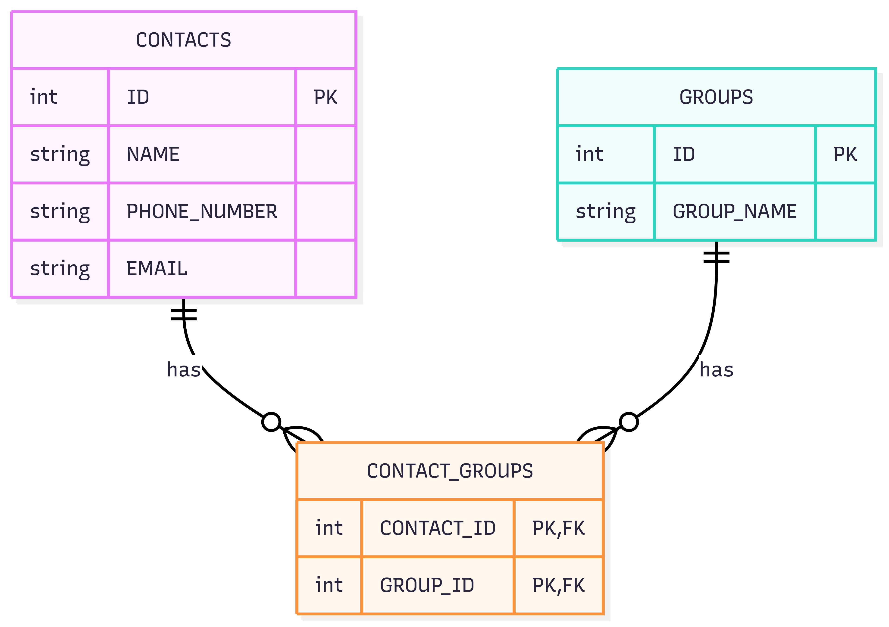

# ContactManagement

A simple Java contact management application using Spring Boot principles, MySQL, Flyway for database migrations, and dotenv for environment configuration.

## Features
- Add, view, update, and delete contacts
- Create and view groups
- Assign contacts to groups
- View contacts in a group
- Database migrations managed by Flyway
- Environment variables managed via `.env` file

## Prerequisites
- Maven
- MySQL server

## Setup

1. **Clone the repository**

2. **Configure environment variables**
   - Copy or edit the `.env` file in the project root:
     ```env
     DB_URL=jdbc:mysql://localhost:3306/contact_manager?createDatabaseIfNotExist=true
     DB_USER=root
     DB_PASSWORD=your_mysql_password
     ```

3. **Start MySQL server**

4. **Build and migrate the database**
   ```sh
   mvn clean compile
   export $(cat .env | xargs)
   mvn flyway:clean   # Only if you want to reset the database (DANGEROUS: deletes all data!)
   mvn exec:java
   ```

## Usage
- Follow the menu in the terminal to manage contacts and groups.
- All data is stored in the MySQL database specified in your `.env` file.

## Database Migrations
- Migration scripts are in `src/main/resources/db/migration/`.
- Managed automatically by Flyway on application start.

## Troubleshooting
- If you see errors about missing tables or failed migrations, run:
  ```sh
  mvn flyway:repair
  mvn flyway:clean   # WARNING: This deletes all data!
  mvn exec:java
  ```
- Ensure your MySQL server is running and credentials in `.env` are correct.

## Entity Relationship Diagram (ERD)

